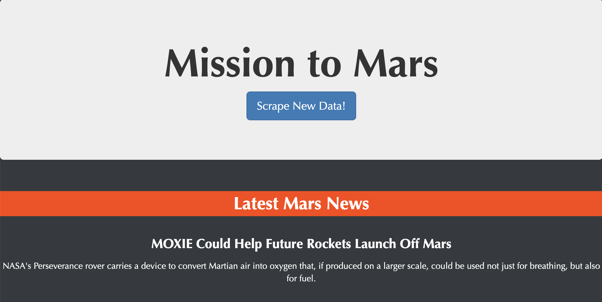
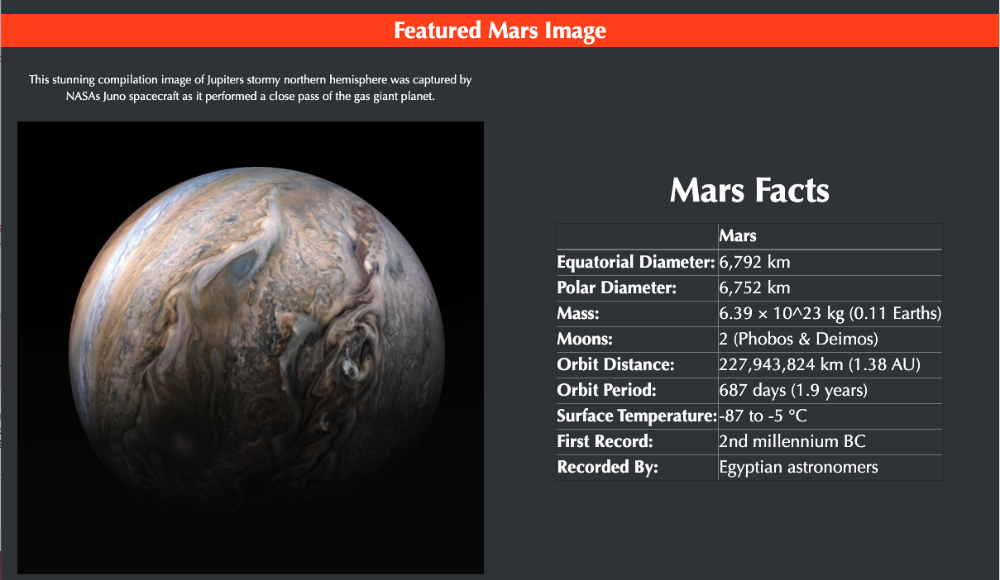
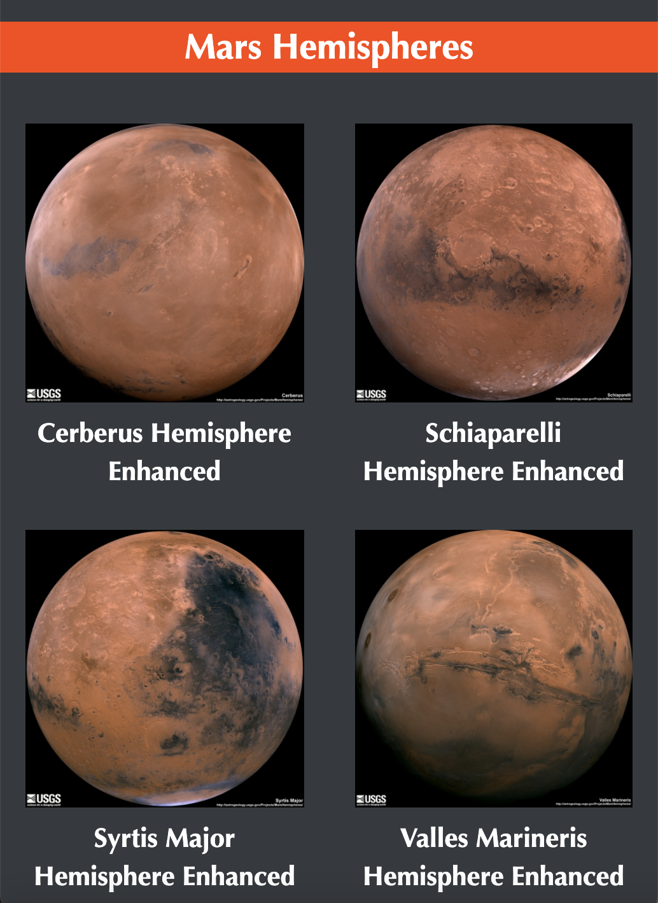

# Web Scraping Challenge

>  Build a web application that scrapes various websites for data related to the Mission to Mars and displays the information in a single HTML page.

## Table of contents
* [Mission to Mars](#Mission-to-Mars)
* [Contact](#Contact)

## Mission to Mars

1. Collect the latest News Title and Paragraph Text from NASA Mars News Site [NASA Mars News Site](https://mars.nasa.gov/news/?page=0&per_page=40&order=publish_date+desc%2Ccreated_at+desc&search=&category=19%2C165%2C184%2C204&blank_scope=Latest)

2. Find the full size featured image from [JPL Space Images](https://www.jpl.nasa.gov/spaceimages/?search=&category=Mars)

3. Find [Mars Facts data](https://space-facts.com/mars/) and display it in a table.

4. Retrieve high resolution images for each of Mars' hemispheres from [USGS Astrogeology](https://astrogeology.usgs.gov/search/results?q=hemisphere+enhanced&k1=target&v1=Mars)

5. Use MongoDB with Flask templating to create a new HTML page that displays all of the information that was scraped above.

## Contact
Created by [@deepavadakan](https://github.com/)